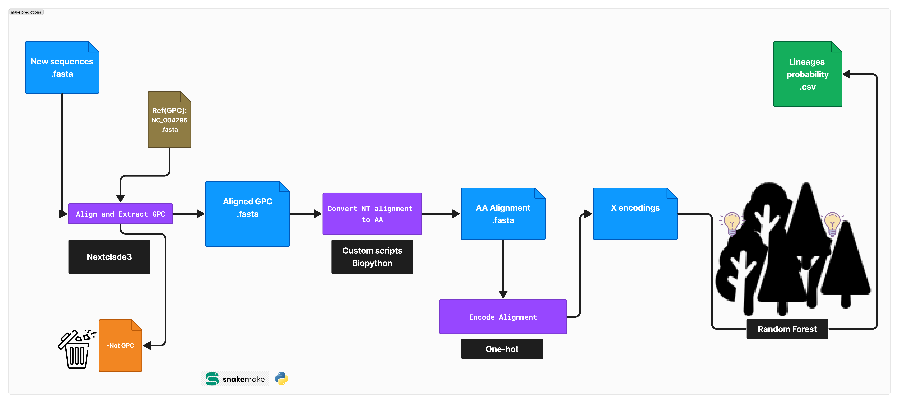

# LASV_lineage_pred

## Overview
Lassa virus lineage prediction based on random forest.

This is one out of 3 for the manuscript suporting data and code.
all here:
## Project Repositories
- **Data and Processing:** [LASV_ML_Manuscript_Data](https://github.com/JoiRichi/LASV_ML_manuscript_data)
- **Lassa Virus Phylogenetics:** [LASV_Phylogenetics_Pipeline](https://github.com/JoiRichi/LASV_phylogenetics_pipeline)
- **Lassa Virus Lineage Prediction:** [LASV_Lineage_Prediction](https://github.com/JoiRichi/LASV_lineage_pred)

## Jupyter Notebooks on Google Colab
- **General Preprocessing:** [Notebook Link](https://colab.research.google.com/drive/1JOgS2-dDoQ7OPHPcXm3AIBDnGQAFxIyR)
- **Motif Search Using RF MD Pcorr:** [Notebook Link](https://colab.research.google.com/drive/1M1yYB65MOWUpMYcn24Jfm6jvZZ13QJ6l)
- **Lassa Virus Lineage Prediction Training:** [Notebook Link](https://colab.research.google.com/drive/1G0lEjuvPR07bcb181Rfhm-S0WenMFSmR)

## Prediction Pipeline Overview


## Running the Pipeline
This pipeline relies on Nextstrain for gene extraction and alignmnent. Please install Nextstrain first by following the [installation guide](https://docs.nextstrain.org/projects/cli/en/stable/installation/) and ensure the Nextstrain command is available in your terminal.

Clone this repository using (or simply download it as a zipped file and unzip.):
```sh
git clone https://github.com/JoiRichi/LASV_lineage_pred.git
```


Enter the Nextstrain shell in the root directory of the pipeline. Note: you must enter the Nextstrain shell each time you want to use the pipeline.

```sh
nextstrain shell .

```

When the shell is active, run the pipeline using:

```sh

snakemake -s predict_lineage.smk --cores 5  # you can change the number of cores
# To re-run the pipeline from scratch, use snakemake -s predict_lineage.smk --cores 5  -F
#please refer to snakemake documentation for help.
```


Upon completion, go to the pipeline 'visuals' folder and open the html files in a browser.


## Model training

Learn how the data was preprocessed here: [LASV_ML_Manuscript_Data](https://github.com/JoiRichi/LASV_ML_manuscript_data). Training process here [Notebook Link](https://colab.research.google.com/drive/1G0lEjuvPR07bcb181Rfhm-S0WenMFSmR).


## Customization

This pipeline has the ability to process multiple FASTA files containing multiple sequences with proficiency and speed. It is recommended that multiple FASTA files are concatenated into one; however, this is not compulsory, especially if the projects are different. By default, the pipeline finds all files with the extension `.fasta` in the **raw_data** folder and tries to find LASV GPC sequences in the files. You can either move your FASTA files into this folder (recommended) or copy the PATH of the folder containing your sequences and use it as `raw_seq_folder` in the `config.yaml` file. 

To ensure Snakemake has a memory of what files have been checked, intermediary files are created for all files checked, even if they contain no GPC sequences. However, those files would be empty.

### Important Outputs

At the end of the run, you can check the **predictions** folder for the CSV files containing the predictions per sample. A visualization of the prediction can be found in the **visuals** folder. Open the HTML files in a browser. The images are high quality and reactive, allowing you to hover over them to see more information.

For further details, please refer to the respective notebooks and repositories linked above. You can also leave a comment for help regarding the pipeline.
